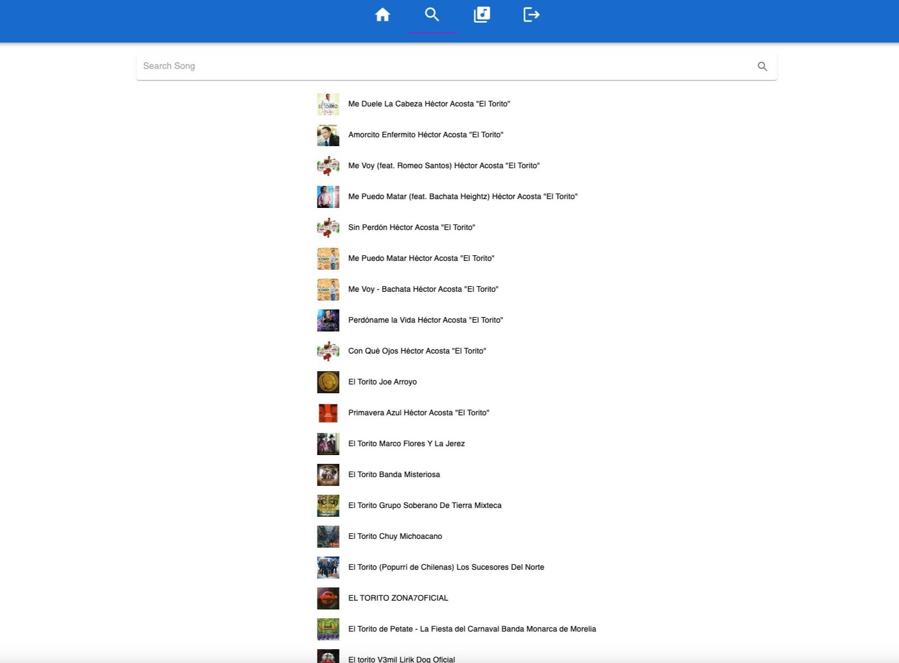
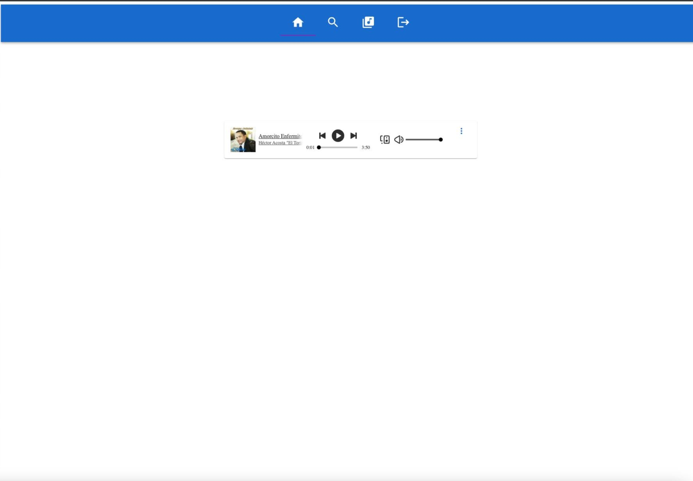

# Playlist App




This App allows you to create and store playlists on your Spotify account. It also provides a built-in music player to play the music right within the app. It requires a Spotify Premium account

## How it Works

The app links to your Spotify account, enabling you to access your music library and playlist data. It uses two libraries for interaction:

- `react-spotify-web-playback`: This library gives you a music player component, allowing you to play, pause, skip, and control songs within the app.
- `spotify-web-api`: JS wrapper for the Spotify Web API. This library includes helper functions for all Spotify's endpoints, enabling actions like creating playlists, adding/removing songs, and fetching playlist information.

The app manages the current song on the music player using React Context and shares this information across different components on the app, ensuring everything stays in sync.

## Documentation

- Documentation for the `spotify-web-api` library: [https://jmperezperez.com/spotify-web-api-js/#src-spotify-web-api.js-constr.prototype.addtrackstoplaylist](https://jmperezperez.com/spotify-web-api-js/#src-spotify-web-api.js-constr.prototype.addtrackstoplaylist)
- Documentation for `react-spotify-web-playback`: [https://www.npmjs.com/package/@chrisuh10/react-spotify-web-playback](https://www.npmjs.com/package/@chrisuh10/react-spotify-web-playback)

## How to Install

1. Sign up for a Spotify Developers account.
2. Create an app and specify that it will use the Web API and Web Playback SDK.
3. In the redirect URIs, enter `http://localhost:8888/callback`.
4. To use this app, you need to be a Spotify Premium subscriber.
5. Download this repository.
6. In the `authorization` folder, open a terminal and install dependencies with `npm i`.
7. In the `playlist` folder, open a terminal and install dependencies with `yarn`.
8. Copy your client ID and client secret and enter them in the `app.js` file inside the authorization code:

```javascript
var client_id = ""; // your clientId
var client_secret = ""; // Your secret
var redirect_uri = "http://localhost:8888/callback"; // Your redirect uri
```

To run the app, follow these steps:

1. Open the `authorization` folder in a terminal.
2. Type `npm run start` to start the authorization server.

3. Open another terminal in the `playlist` folder.
4. Type `yarn dev` to start the playlist app.

Make sure to run the authorization server first before starting the playlist app.
